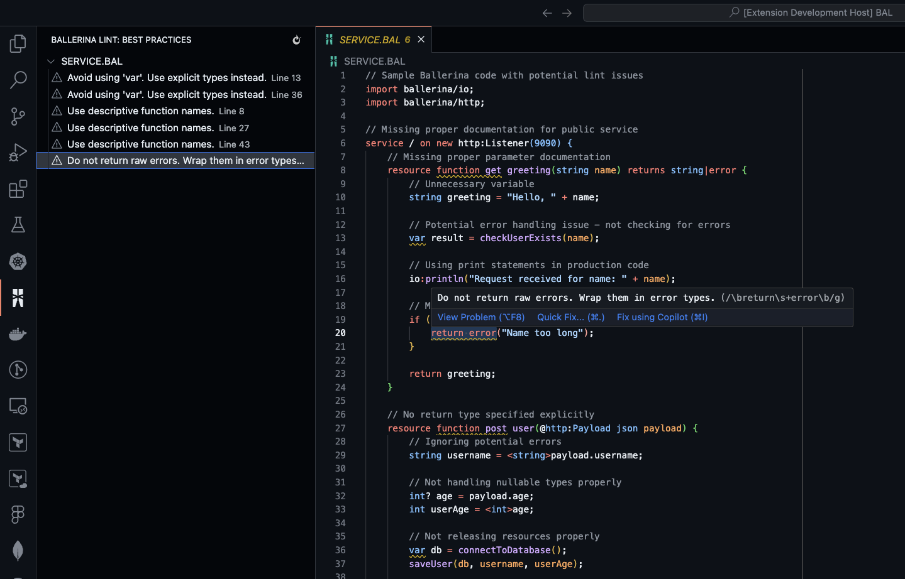
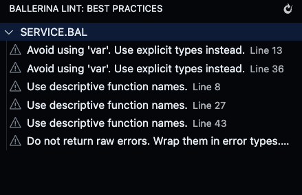
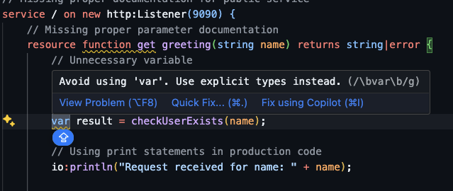
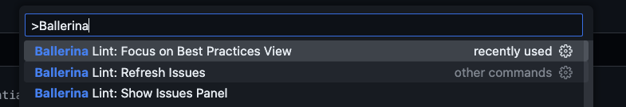
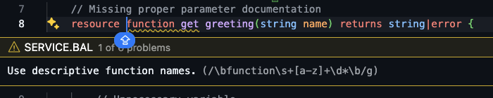

# Ballerina Lint

  

A fully functional Ballerina best practices checker extension for Visual Studio Code. This linter helps developers adhere to Ballerina programming best practices, enhancing code quality and maintainability.

## Table of Contents
- [Screenshots](#screenshots)
- [Features](#features)
- [Supported Best Practices](#supported-best-practices)
- [Installation](#installation)
- [Requirements](#requirements)
- [Extension Settings](#extension-settings)
- [Usage](#usage)
- [Coming Soon](#coming-soon)
- [Contributing](#contributing)
- [License](#license)
- [Acknowledgments](#acknowledgments)

## Screenshots

### Issue Detection in Editor

*The extension highlights issues directly in your editor with detailed explanations*

### Diagnostics Panel

*View all issues in one place with the dedicated diagnostics panel*

### Quick Fixes

*Suggested fixes are available with a single click*

### Settings Configuration

*Customize which rules to apply and their severity levels*

### Fixes

*Easily apply suggested fixes to resolve issues*

## Features

- **Best Practices Checking**: Automatically analyzes your Ballerina code against established best practices
- **Real-time Diagnostics**: Provides immediate feedback as you code
- **Quick Fixes**: Offers suggestions for resolving identified issues
- **Customizable Rules**: Configure which best practices to enforce
- **Sidebar Integration**: Explore all diagnostics in a dedicated sidebar view

### Supported Best Practices

Based on [Learn Ballerina](https://learn-ballerina.github.io/) guidelines, this extension checks for:

1. **Proper Error Handling**
   - Ensure errors are properly handled and not ignored
   - Check for appropriate error propagation

2. **Memory Management**
   - Identify potential memory leaks
   - Suggest optimizations for resource-intensive operations

3. **API Design Principles**
   - Check for consistent API naming conventions
   - Ensure proper documentation of public APIs

4. **Concurrency Best Practices**
   - Detect common concurrency pitfalls
   - Suggest improvements for concurrent code

5. **Security Practices**
   - Identify potential security vulnerabilities
   - Enforce secure coding patterns

6. **Performance Optimizations**
   - Suggest more efficient code alternatives
   - Highlight performance bottlenecks

## Installation

Since this extension is not yet available on the VS Code Marketplace, you can install it using the VSIX package:

1. Download the latest VSIX package from the [GitHub releases page](https://github.com/PramithaMJ/ballerina-lint/releases)
2. Open VS Code
3. Go to the Extensions view (View → Extensions or press `Ctrl+Shift+X`)
4. Click on the "..." menu (top-right of the Extensions view)
5. Select "Install from VSIX..."
6. Navigate to and select the downloaded ballerina-lint-1.0.0.vsix file
7. Restart VS Code when prompted

## Requirements

- Visual Studio Code 1.80.0 or newer
- Ballerina installation (version 2.0.0 or newer recommended)

## Extension Settings

This extension contributes the following settings:

* `ballerina-lint.enable`: Enable/disable the linter
* `ballerina-lint.rules`: Configure which rules to enable/disable
* `ballerina-lint.severityOverrides`: Override the severity level of specific rules
* `ballerina-lint.ignorePatterns`: Specify files or patterns to ignore

## Usage

1. Open a Ballerina file (`.bal` extension)
2. The extension automatically activates and begins analyzing your code
3. Issues are highlighted directly in the editor
4. Hover over highlighted code to see details about the issue
5. Use the Ballerina Lint sidebar to see all detected issues in your workspace
6. Click on issues to navigate to the corresponding code location

## Coming Soon

- Additional rule sets for more comprehensive linting
- Integration with Ballerina project configuration files
- Rule customization through configuration files
- Team-based rule sharing
- VS Code Marketplace release

## Contributing

Contributions are welcome! Please feel free to submit a Pull Request.

1. Fork the repository
2. Create your feature branch (`git checkout -b feature/amazing-feature`)
3. Commit your changes (`git commit -m 'Add some amazing feature'`)
4. Push to the branch (`git push origin feature/amazing-feature`)
5. Open a Pull Request

## License

Distributed under the Apache License. See `LICENSE` for more information.

## Acknowledgments

- [Ballerina](https://ballerina.io/) - The programming language
- [Learn Ballerina](https://learn-ballerina.github.io/) - Best practices guide
- [VS Code Extension API](https://code.visualstudio.com/api) - Extension development resources

---

**Note**: This extension uses the Ballerina logo, which is a trademark of WSO2, Inc. This extension is not officially affiliated with or endorsed by Ballerina or WSO2, Inc.